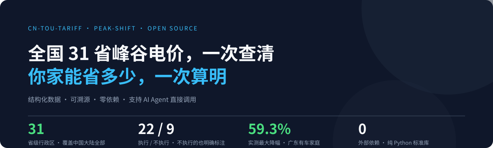
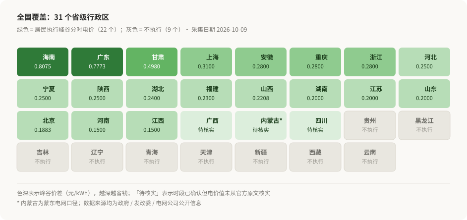
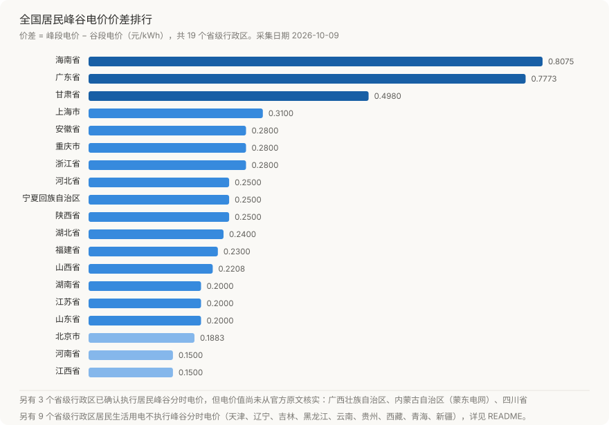

# cn-tou-tariff



**中国居民分时（峰谷）电价数据库** · 结构化 · 可溯源 · 标注可信度

[](LICENSE)
[](data/)
[](scripts/)
[](CONTRIBUTING.md)

---

> **全国 31 省峰谷电价，一次查清。**
> 覆盖中国大陆全部省级行政区——含 **22 个** 居民执行峰谷分时的地区，以及 **9 个不执行**的地区（后者同样明确标注官方原因，而不是留空）。

```bash
git clone https://github.com/xfnylqt/cn-tou-tariff.git
cd cn-tou-tariff && python scripts/query.py --province 广东
```



---

## 为什么需要这个项目

居民峰谷电价是**能直接省钱**的公共信息，但它同时具备三个让人头疼的特点：

1. **各省规则完全不同** —— 分界时间从 20:00 到 22:00 都有，谷段窗口从 8 小时到 16 小时不等
2. **同一省内还分用户类型与季节** —— 山东采暖季与平时段不同，江苏居民与充电桩不同，北京普通居民根本不执行
3. **无处可查、格式不一** —— 信息散落在各市发改委通知、供电局公示、办理问答页里

这个项目把它变成**结构化的 JSON 数据 + 明确的可信度标注**，让任何工具（优化算法、记账 App、AI 助手）都能直接读取，而不必重新翻一遍政策文件。

> 配套项目：优化模型 [`peak-shift-engine`](../peak-shift-engine) · 可视化 [`peak-shift-studio`](../peak-shift-studio)

---

## 数据总览



已收录 **31 个省级行政区**（截至 2026-10-09）。其中 **22 个** 的居民生活用电执行峰谷分时电价，**9 个** 不执行——**后者同样被明确记录并说明原因，而不是留空**。

### 一、居民执行峰谷分时电价（22 个）

| 省份 | 峰段 | 谷段 | 峰价 | 谷价 | 价差 | 可信度 |
|---|---|---|---|---|---|---|
| 海南 | 16-24 | 02-10 | 1.0643 | 0.2568 | **0.8075** | official |
| 广东 | 10-12, 14-19 | 00-08 | 1.0011 | 0.2238 | 0.7773 | official |
| 甘肃 | 07-09, 18-24 | 02-04, 11-17 | 0.7590 | 0.2610 | 0.4980 | official |
| 上海 | 06-22 | 22-06 | 0.6170 | 0.3070 | 0.3100 | official-media |
| 浙江 | 08-22 | 22-08 | 0.5680 | 0.2880 | 0.2800 | official |
| 安徽 | 08-22（平段） | 22-08 | 0.5953 | 0.3153 | 0.2800 | official |
| 重庆 | 11-17, 20-22 | 00-08 | 0.6200 | 0.3400 | 0.2800 | official-media |
| 宁夏 | 08-22 | 22-08 | 0.4986 | 0.2486 | 0.2500 | official |
| 河北 | 08-22 | 22-08 | 0.5500 | 0.3000 | 0.2500 | official |
| 陕西 | 08-20 | 20-08 | 0.5400 | 0.2900 | 0.2500 | official |
| 湖北 | 14-17, 19-22 | 22-14 | 0.5980 | 0.3580 | 0.2400 | **unverified** |
| 福建 | 08-22 | 22-08 | 0.5283 | 0.2983 | 0.2300 | official |
| 山西 | 08-22 | 22-08 | 0.5070 | 0.2862 | 0.2208 | official |
| 江苏 | 08-21 | 21-08 | 0.5583 | 0.3583 | 0.2000 | official |
| 山东 | 08-22 | 22-08 | 0.5769 | 0.3769 | 0.2000 | official |
| 湖南 | 11-14, 18-23 | 23-07 | 0.7040 | 0.5040 | 0.2000 | official |
| 北京 | 06-21 | 21-06 | 0.4883 | 0.3000 | 0.1883 | official |
| 河南 | 08-22 | 22-08 | 0.5900 | 0.4400 | 0.1500 | official |
| 江西 | 08-22 | 22-08 | 0.6300 | 0.4800 | 0.1500 | official |
| 四川 | 10-12, 17-22 | 23-07 | — | — | — | official |
| 广西 | 16-24 | 01-07, 12-14 | — | — | — | official-media |
| 内蒙古（蒙东） | 07:30-11:30, 17-21 | 21-06 | — | — | — | official-media |

*(单位：元/kWh；— 表示该字段尚未从官方原文核实。北京为电采暖试点，湖南广西为居民充电设施，详见各省文件。)*

### 二、居民**不**执行峰谷分时电价（9 个）

| 省份 | 官方说明 |
|---|---|
| 天津 | 居民生活用电（不含充电桩）暂不实施；居民充电桩可自愿执行（峰 0.69 / 谷 0.30） |
| 辽宁 | 现阶段居民不执行；仅居民电采暖用户在采暖期执行 |
| 吉林 | 分时适用于工商业、电采暖与充换电设施用户 |
| 黑龙江 | 居民执行阶梯；分时适用于充电桩与煤改电 |
| 云南 | 官方明确：居民和农业用电不执行分时电价 |
| 贵州 | 官方明确：居民生活用电暂未实行峰谷分时电价 |
| 西藏 | 居民全区统一 0.49 元/千瓦时 + 分季节阶梯，不执行峰谷 |
| 青海 | 销售电价表显示居民仅列示阶梯，未设峰谷 |
| 新疆 | 官方明确：居民、农业用电不执行 |

> 每个「不执行」的省份都保留了 `no_tou_reason` 字段说明原因，并在 `exception` 字段记录**例外情形**（如电采暖、充电桩）。

### 值得注意的发现

- **海南、广东的峰谷价差超过 0.77 元/kWh，而河南、江西仅 0.15 元** —— 同样是「谷电」，**不同省份的省钱空间相差 5 倍以上**
- **有 9 个省级行政区的居民根本不执行峰谷电价**，这一点被市面上大量「省钱攻略」集体忽略
- **新疆官方专门辟过谣**：网传「申请变更峰谷电价可年省百元」系谣言——昌吉地区居民用电全天统一 0.39 元/度
- **北京普通居民同样不执行**，该政策为面向电采暖用户的试点
- **安徽只有「平段/谷段」，没有峰段**；**陕西 20:00 即进入谷段**，谷段窗口最宽
- **广东谷段从 00:00 开始**而非 22:00，是结构最特殊的省份之一；**四川一年三套季节时段**

---

## 可信度分级

本项目对每条数据标注可信度，**未核实的数据不会被伪装成权威数据**：

| 级别 | 含义 | 处理方式 |
|---|---|---|
| `official` | 政府 / 发改委 / 电网公司官网原文 | 可直接使用 |
| `official-media` | 官方媒体转载的官方文件（如「上海发布」） | 可使用，建议核对原始文件 |
| `unverified` | 自媒体汇编，**未找到官方原文** | ⚠️ **不应作为测算依据** |

同时，数值字段为 `null` 表示「时段已确认但电价值尚未核实」，而不是 0。

---

## 快速开始

无需安装任何依赖（Python 3.8+ 标准库即可）。

```bash
git clone https://github.com/xfnylqt/cn-tou-tariff.git
cd cn-tou-tariff

# 列出所有省份
python scripts/query.py --list

# 按价差排序（找出省钱空间最大的省份）
python scripts/query.py --list --sort-by spread

# 查询单个省份
python scripts/query.py --province 浙江

# JSON 输出，供其他程序消费
python scripts/query.py --province 广东 --json

# 校验数据完整性
python scripts/validate.py
python scripts/validate.py --strict   # 严格模式：存在未核实数据即失败
```

---

## 数据结构

每个省份一个文件，遵循 [`schema/tariff.schema.json`](schema/tariff.schema.json)：

```jsonc
{
  "region": "浙江省",
  "province_code": "ZJ",
  "effective_date": "2026-01-01",
  "accessed_date": "2026-10-09",
  "source": {
    "name": "仙居县人民政府 - 居民生活用电「峰谷电」线上申请办理流程",
    "url": "http://www.zjxj.gov.cn/...",
    "publisher": "浙里办 / 国网浙江营销服务中心"
  },
  "confidence": "official",
  "customer_type": "居民一户一表",
  "optional": true,
  "periods": [
    { "name": "peak",   "label": "峰段", "start": "08:00", "end": "22:00", "price": 0.568 },
    { "name": "valley", "label": "谷段", "start": "22:00", "end": "08:00", "price": 0.288 }
  ],
  "tiers": [
    { "tier": 1, "range": "年用电量 ≤2760 千瓦时", "peak": 0.568, "valley": 0.288 }
  ]
}
```

**扩展字段**（应对各省差异）：

| 字段 | 用途 | 示例省份 |
|---|---|---|
| `seasonal[]` | 季节性时段差异 | 山东（采暖季）、四川（三季） |
| `tiers[]` | 阶梯电价与分时叠加 | 全部 |
| `variants[]` | 同一省内不同用户类型 | 江苏（居民 vs 充电桩） |
| `residential_valley_override` | 居民专属时段覆盖通用时段 | 四川（居民谷段 23:00-07:00） |
| `pending[]` | 明确列出尚未核实的信息 | 四川、湖北 |

---

## 数据来源

所有来源均记录在各省份文件的 `source` 字段中，含**机构名、URL、政策文号**。**采集日期：2026-10-09。**

来源类型分布：

| 来源类型 | 数量 | 说明 |
|---|---|---|
| 政府 / 发改委官网 | 18 | 省市级人民政府、发改委通知原文 |
| 电网公司官方 | 3 | 国网省公司销售电价表 |
| 官方媒体转载 | 2 | 「上海发布」、省级党媒等 |
| ⚠️ 未能核实 | 1 | 湖北（已标注 `unverified`，不以官方名义呈现） |

代表性来源：

- **广东** — 广东电网河源龙川供电局公示 / 广州从化区政府（粤发改价格〔2021〕331号）
- **四川** — 四川省发展和改革委员会（川发改价格〔2025〕185号）
- **河北** — 河北省发展和改革委员会（冀发改能价〔2022〕1535号）
- **贵州** — 贵州省发改委答问「能否执行夜间峰谷电收费」
- **新疆** — 自治区发改委 / 「新疆网络辟谣」官方辟谣

---

## 免责声明

- 电价政策会调整，**请以当地供电部门公布的最新信息为准**
- 本项目数据由社区维护，可能存在滞后或录入误差
- 标注 `unverified` 的数据**不得**用于实际决策
- 本项目与任何政府机构、电网企业无隶属关系

---

## 贡献

最需要的贡献是**补齐缺失省份**与**核实存疑数据**。详见 [CONTRIBUTING.md](CONTRIBUTING.md)。

核心原则：**宁可标注「未核实」，也不要填入不确定的数值。**

## 许可证

[MIT](LICENSE)
